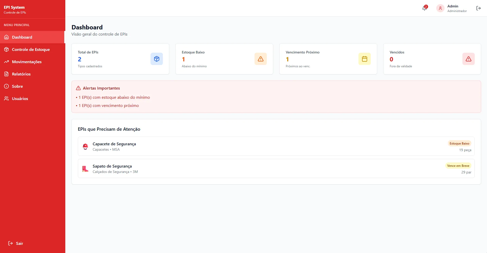
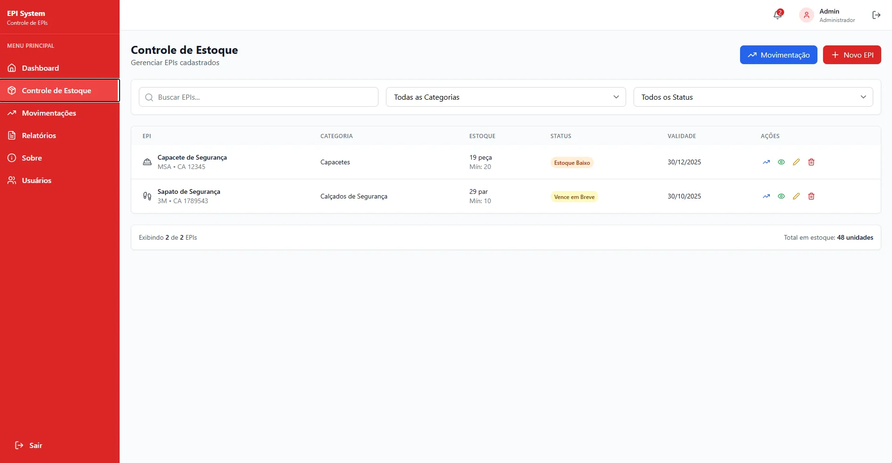
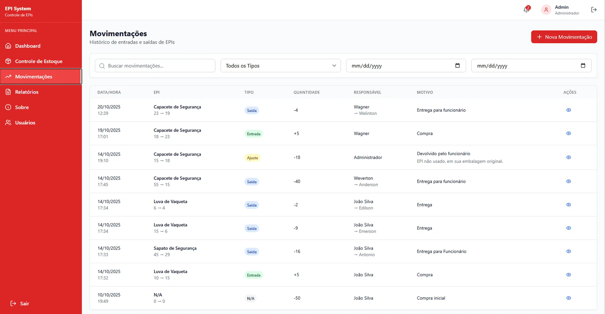
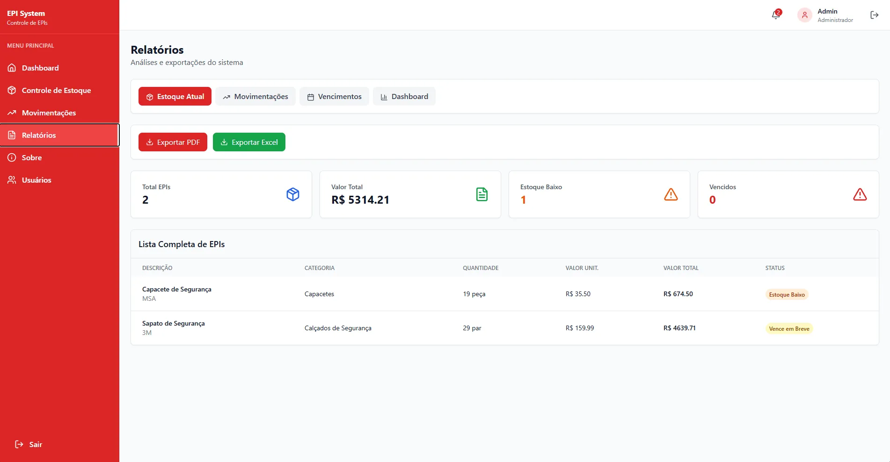
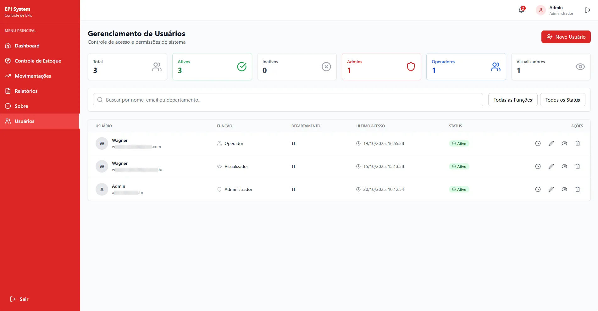
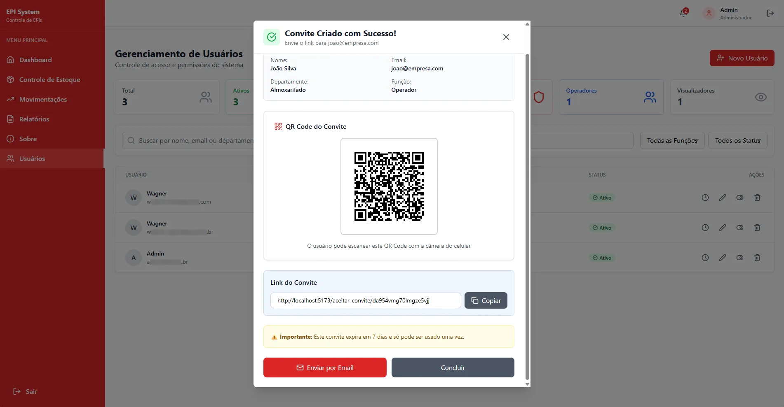

# 🛡️ EPI System - Sistema de Gestão de EPIs

<div align="center">
  
  
  
  
  
</div>

<br>

<div align="center">
  <p><strong>Sistema completo para gerenciamento de Equipamentos de Proteção Individual</strong></p>
  <p>Solução moderna e intuitiva para controle de estoque, movimentações e relatórios de EPIs</p>
  <p>
    <a href="https://epi-system.wsabor.dev" target="_blank">🌐 Ver Demo</a> •
    <a href="#-instalação">📦 Instalação</a> •
    <a href="#-funcionalidades">⚡ Funcionalidades</a> •
    <a href="#-tecnologias-utilizadas">🛠️ Tecnologias</a>
  </p>
</div>

---

## 📋 Índice

- [Sobre o Projeto](#-sobre-o-projeto)
- [Demo Online](#-demo-online)
- [Funcionalidades](#-funcionalidades)
- [Tecnologias Utilizadas](#-tecnologias-utilizadas)
- [Pré-requisitos](#-pré-requisitos)
- [Instalação](#-instalação)
- [Configuração](#-configuração)
- [Como Usar](#-como-usar)
- [Estrutura do Projeto](#-estrutura-do-projeto)
- [Sistema de Permissões](#-sistema-de-permissões)
- [Screenshots](#-screenshots)
- [Roadmap](#-roadmap)
- [Deploy](#-deploy)
- [Licença](#-licença)
- [Contato](#-contato)

---

## 🎯 Sobre o Projeto

O **EPI System** é uma aplicação web moderna e responsiva desenvolvida para otimizar o gerenciamento completo do ciclo de vida dos Equipamentos de Proteção Individual, desde a entrada no estoque até a distribuição aos funcionários.

### 💡 Problema que resolve:

- ❌ Controle manual de EPIs propenso a erros
- ❌ Falta de rastreabilidade de movimentações
- ❌ Dificuldade em gerar relatórios
- ❌ Perda de EPIs por vencimento
- ❌ Gestão ineficiente de estoque

### ✅ Solução oferecida:

- ✅ **Controle digitalizado** em tempo real
- ✅ **Rastreamento completo** de movimentações
- ✅ **Alertas automáticos** de vencimento e estoque baixo
- ✅ **Relatórios PDF/Excel** instantâneos
- ✅ **Sistema de permissões** por função
- ✅ **Auditoria completa** de ações
- ✅ **Interface moderna** e intuitiva
- ✅ **Sistema de convites** com QR Code e email

---

## 🌐 Demo Online

🚀 **Acesse a aplicação**: [https://epi-system.wsabor.dev](https://epi-system.wsabor.dev)

### Credenciais de Teste:

**Administrador:**

- Email: `admin@demo.com`
- Senha: `demo123`

**Operador:**

- Email: `operador@demo.com`
- Senha: `demo123`

**Visualizador:**

- Email: `viewer@demo.com`
- Senha: `demo123`

> ⚠️ **Nota**: Esta é uma versão de demonstração. Os dados podem ser resetados periodicamente.

---

## ⚡ Funcionalidades

### 🏠 Dashboard Inteligente

- 📊 Visão geral do estoque em tempo real
- 📈 Indicadores visuais (EPIs ativos, vencidos, estoque baixo)
- 📉 Gráficos interativos de distribuição por categoria
- ⏰ Timeline de movimentações recentes
- 🔔 Alertas automáticos de estoque crítico

### 📦 Controle de Estoque

- ➕ **CRUD completo** de EPIs
- 📝 **Cadastro detalhado** com:
  - Informações básicas (descrição, marca, tamanho, CA)
  - Controle de quantidade e estoque mínimo
  - Datas de validade com alertas inteligentes
  - Valores, custos e fornecedores
- 🔍 **Busca e filtros avançados**
- 👁️ **Modal de detalhes** com histórico completo
- ⚡ **Validações em tempo real**

### 🔄 Movimentações

- 📥 **Entrada**: Compras e recebimentos
- 📤 **Saída**: Distribuição aos funcionários
- ⚙️ **Ajuste**: Correções de inventário
- ⚠️ **Perda**: Registro de danos/extravios
- 📝 **Histórico completo** com timestamps
- 👤 **Rastreamento de responsáveis**
- 🔗 **Integração automática** com estoque

### 📊 Relatórios Profissionais

- 📄 **Relatório de Estoque**: Visão completa com valores
- 📋 **Relatório de Movimentações**: Histórico detalhado
- ⏰ **Relatório de Vencimentos**: EPIs vencidos e próximos
- 📈 **Dashboard Avançado**: Análises estatísticas
- 💾 **Exportação**: PDF e Excel
- 🎨 **Design profissional** com tabelas formatadas

### 👥 Gerenciamento de Usuários

- 🔐 **3 níveis de permissão**:
  - **Administrador**: Acesso total
  - **Operador**: Gerencia EPIs e movimentações
  - **Visualizador**: Apenas consulta
- 📧 **Sistema de convites** por email
- 📱 **QR Code** para acesso rápido
- ✅ **Ativação/desativação** de contas
- 📜 **Log de auditoria** completo

### 🔐 Autenticação e Segurança

- 🔑 Firebase Authentication
- 📧 Login com email/senha
- 🔄 Registro de novos usuários
- 🔓 Recuperação de senha
- 🛡️ Proteção de rotas
- 💾 Sessão persistente
- 🚪 Logout seguro

---

## 🛠️ Tecnologias Utilizadas

### Frontend

```
React 19.1.1          - Biblioteca JavaScript para interfaces
Vite 7.1.2            - Build tool e dev server ultrarrápido
Tailwind CSS 3.4.17   - Framework CSS utility-first
React Router 7.9.4    - Roteamento de páginas
Lucide React 0.544.0  - Ícones modernos e elegantes
Recharts 3.2.1        - Biblioteca de gráficos interativos
```

### Backend/Database

```
Firebase 12.2.1
├── Authentication    - Autenticação de usuários
├── Firestore        - Banco NoSQL em tempo real
└── Hosting          - Deploy e hospedagem
```

### Bibliotecas Auxiliares

```
jsPDF 3.0.3              - Geração de PDFs
jsPDF-AutoTable 5.0.2    - Tabelas em PDFs
SheetJS (xlsx) 0.18.5    - Geração de Excel
EmailJS 4.4.1            - Envio de emails
QRCode.React 4.2.0       - Geração de QR Codes
```

### Dev Tools

```
ESLint 9.33.0        - Linting de código
PostCSS 8.5.6        - Processamento CSS
Autoprefixer 10.4.21 - Prefixos CSS automáticos
```

---

## 📦 Pré-requisitos

Antes de começar, certifique-se de ter instalado:

- ✅ **Node.js** 18+ ([Download](https://nodejs.org/))
- ✅ **npm** ou **yarn**
- ✅ Conta no **Firebase** ([Criar conta gratuita](https://firebase.google.com/))
- ✅ Conta no **EmailJS** ([Criar conta](https://www.emailjs.com/)) - Opcional
- ✅ Editor de código (recomendado: [VS Code](https://code.visualstudio.com/))

---

## 🚀 Instalação

### 1️⃣ Clone o repositório

```bash
git clone https://github.com/wsabor/epi-system.git
cd epi-system
```

### 2️⃣ Instale as dependências

```bash
npm install
```

### 3️⃣ Configure o Firebase

#### a) Crie um projeto no Firebase:

1. Acesse [Firebase Console](https://console.firebase.google.com/)
2. Clique em "Adicionar projeto"
3. Siga os passos de configuração

#### b) Configure Authentication:

1. No Firebase Console, vá em **Authentication**
2. Clique em **"Get Started"**
3. Ative **Email/Password** como provedor

#### c) Configure Firestore:

1. Vá em **Firestore Database**
2. Clique em **"Criar banco de dados"**
3. Escolha **"Iniciar no modo de produção"**
4. Selecione a localização (southamerica-east1)

#### d) Obtenha as credenciais:

1. Vá em **Configurações do projeto** (ícone de engrenagem)
2. Role até **"Seus aplicativos"**
3. Clique no ícone **</>** (Web)
4. Registre o app
5. Copie as credenciais do Firebase

### 4️⃣ Configure as variáveis de ambiente

Crie um arquivo `.env.local` na raiz do projeto:

```env
VITE_FIREBASE_API_KEY=sua_api_key_aqui
VITE_FIREBASE_AUTH_DOMAIN=seu_projeto.firebaseapp.com
VITE_FIREBASE_PROJECT_ID=seu_projeto_id
VITE_FIREBASE_STORAGE_BUCKET=seu_projeto.appspot.com
VITE_FIREBASE_MESSAGING_SENDER_ID=seu_sender_id
VITE_FIREBASE_APP_ID=seu_app_id
```

> ⚠️ **IMPORTANTE**:
>
> - Nunca commite o arquivo `.env.local` no Git!
> - O arquivo `.gitignore` já está configurado para ignorá-lo

### 5️⃣ Configure as regras do Firestore

No Firebase Console → **Firestore Database** → **Regras**, cole:

```javascript
rules_version = '2';
service cloud.firestore {
  match /databases/{database}/documents {

    function isAuthenticated() {
      return request.auth != null;
    }

    function isAdmin() {
      return isAuthenticated() &&
             get(/databases/$(database)/documents/usuarios/$(request.auth.uid)).data.role == 'admin';
    }

    match /epis/{epiId} {
      allow read: if isAuthenticated();
      allow write: if isAuthenticated();
    }

    match /movimentacoes/{movimentacaoId} {
      allow read: if isAuthenticated();
      allow write: if isAuthenticated();
    }

    match /usuarios/{userId} {
      allow read: if isAuthenticated();
      allow update, delete: if isAdmin();
      allow create: if request.auth != null && request.auth.uid == userId;
    }

    match /convites/{conviteId} {
      allow create: if isAdmin();
      allow list: if isAdmin();
      allow get: if true;
      allow update: if request.resource.data.usado == true &&
                       resource.data.usado == false;
    }

    match /logs/{logId} {
      allow read: if isAuthenticated();
      allow create: if isAuthenticated();
      allow update, delete: if false;
    }
  }
}
```

Clique em **"Publicar"**.

### 6️⃣ Execute o projeto

```bash
npm run dev
```

🎉 Acesse: **http://localhost:5173**

---

## ⚙️ Configuração

### 🔐 Criando o Primeiro Usuário Admin

#### Método 1: Via Firebase Console (Recomendado)

1. **Firebase Console** → **Authentication** → **Add user**
2. Adicione:
   - Email: `admin@seudominio.com`
   - Senha: `senha_segura_123`
3. Copie o **UID** do usuário
4. Vá em **Firestore Database** → **Adicionar documento**
5. Collection: `usuarios`, Document ID: **Cole o UID**
6. Campos:
   ```
   nome: "Admin Sistema"
   email: "admin@seudominio.com"
   role: "admin"
   departamento: "TI"
   telefone: "(11) 98765-4321"
   ativo: true
   dataCriacao: [timestamp atual]
   ultimoAcesso: null
   ```
7. Salvar

✅ Pronto! Faça login com esse usuário.

#### Método 2: Via Registro na Aplicação

1. Acesse a tela de registro
2. Preencha os dados
3. Após criar, vá no Firestore e **mude o role para "admin"**

### 📧 Configurar EmailJS (Opcional - Sistema de Convites)

1. Acesse [EmailJS](https://www.emailjs.com/) e crie uma conta
2. Adicione um serviço de email (Gmail recomendado)
3. Crie um template de email
4. Copie: **Service ID**, **Template ID** e **Public Key**
5. Edite `src/services/emailService.js`:
   ```javascript
   const EMAILJS_CONFIG = {
     serviceId: "seu_service_id",
     templateId: "seu_template_id",
     publicKey: "sua_public_key",
   };
   ```

---

## 📖 Como Usar

### 1️⃣ Login no Sistema

1. Acesse a aplicação
2. Digite email e senha
3. Clique em "Entrar"

### 2️⃣ Cadastrar um EPI

1. Menu lateral → **"Controle de Estoque"**
2. Botão **"Novo EPI"**
3. Preencha:
   - Descrição, categoria, tamanho
   - Quantidade atual e mínima
   - Marca, nº CA, validade
   - Valor unitário e fornecedor
4. **"Salvar"**

### 3️⃣ Registrar Movimentação

1. **"Movimentações"** → **"Nova Movimentação"**
2. Selecione o EPI
3. Escolha o tipo:
   - **Entrada**: Compra
   - **Saída**: Entrega ao funcionário
   - **Ajuste**: Correção
   - **Perda**: Dano/Extravio
4. Quantidade e responsável
5. **"Salvar"**

### 4️⃣ Gerar Relatórios

1. **"Relatórios"**
2. Escolha o tipo
3. Aplique filtros
4. **"Exportar PDF"** ou **"Exportar Excel"**

### 5️⃣ Convidar Usuários

1. **"Usuários"** → **"Novo Usuário"**
2. Preencha dados e selecione função
3. **"Enviar Convite"**
4. Copie o link OU escaneie QR Code OU envie email

---

## 📁 Estrutura do Projeto

```
epi-system/
├── public/
├── src/
│   ├── components/
│   │   ├── auth/                 # Autenticação
│   │   │   ├── Login.jsx
│   │   │   ├── Register.jsx
│   │   │   ├── ForgotPassword.jsx
│   │   │   ├── AceitarConvite.jsx
│   │   │   └── AuthWrapper.jsx
│   │   ├── layout/               # Layout
│   │   │   ├── Header.jsx
│   │   │   └── Sidebar.jsx
│   │   ├── modals/               # Modais
│   │   │   ├── EPIModal.jsx
│   │   │   ├── EPIDetalhesModal.jsx
│   │   │   ├── MovimentacaoModal.jsx
│   │   │   ├── MovimentacaoDetalhesModal.jsx
│   │   │   └── ConviteUsuarioModal.jsx
│   │   ├── pages/                # Páginas
│   │   │   ├── Dashboard.jsx
│   │   │   ├── ControleEstoque.jsx
│   │   │   ├── Movimentacoes.jsx
│   │   │   ├── Relatorios.jsx
│   │   │   ├── Sobre.jsx
│   │   │   └── Usuarios/
│   │   │       ├── Usuarios.jsx
│   │   │       ├── FormularioUsuario.jsx
│   │   │       ├── ModalConfirmacao.jsx
│   │   │       └── LogAuditoria.jsx
│   │   └── ui/                   # Componentes UI
│   │       ├── StatsCard.jsx
│   │       └── ProtectedAction.jsx
│   ├── contexts/                 # Contextos React
│   │   ├── AuthContext.jsx
│   │   └── PermissionsContext.jsx
│   ├── hooks/                    # Custom Hooks
│   │   ├── useEPIs.js
│   │   ├── useMovimentacoes.js
│   │   ├── useUsuarios.js
│   │   └── useLogs.js
│   ├── services/                 # Serviços
│   │   ├── firebase.js
│   │   ├── epiServices.js
│   │   ├── movimentacaoService.js
│   │   └── emailService.js
│   ├── utils/                    # Utilitários
│   │   └── seedUsuarios.js
│   ├── App.jsx
│   ├── main.jsx
│   └── index.css
├── .env.local                    # Variáveis de ambiente
├── .gitignore
├── package.json
├── vite.config.js
├── tailwind.config.js
├── vercel.json                   # Config deploy Vercel
└── README.md
```

---

## 🔐 Sistema de Permissões

| Funcionalidade          | 👑 Admin | 🔧 Operador | 👁️ Visualizador |
| ----------------------- | :------: | :---------: | :-------------: |
| Ver Dashboard           |    ✅    |     ✅      |       ✅        |
| Ver Estoque             |    ✅    |     ✅      |       ✅        |
| Criar/Editar EPIs       |    ✅    |     ✅      |       ❌        |
| Excluir EPIs            |    ✅    |     ✅      |       ❌        |
| Registrar Movimentações |    ✅    |     ✅      |       ❌        |
| Gerar Relatórios        |    ✅    |     ✅      |       ✅        |
| Gerenciar Usuários      |    ✅    |     ❌      |       ❌        |
| Ver Logs de Auditoria   |    ✅    |     ❌      |       ❌        |
| Convidar Usuários       |    ✅    |     ❌      |       ❌        |

---

## 📸 Screenshots

### 🏠 Dashboard



### 📦 Controle de Estoque



### 🔄 Movimentações



### 📊 Relatórios



### 👥 Gerenciamento de Usuários



### 📧 Sistema de Convites



---

## 🗺️ Roadmap

### ✅ Versão 1.0 (Atual)

- [x] Sistema de autenticação
- [x] CRUD de EPIs completo
- [x] Controle de movimentações
- [x] Relatórios PDF/Excel
- [x] Gerenciamento de usuários
- [x] Sistema de permissões
- [x] Sistema de convites com QR Code
- [x] Modal de detalhes de EPIs
- [x] Modal de detalhes de movimentações
- [x] Página "Sobre"

### 🚧 Versão 2.0 (Em Planejamento)

- [ ] Notificações push em tempo real
- [ ] Dashboard com IA e predições
- [ ] Modo escuro (Dark Mode)
- [ ] PWA - Funciona offline
- [ ] Scanner de código de barras/QR Code
- [ ] API REST pública
- [ ] Aplicativo mobile (React Native)
- [ ] Integração com WhatsApp

### 💡 Versão 3.0 (Futuro)

- [ ] IA para previsão de demanda
- [ ] Integração com sistemas ERP
- [ ] Relatórios avançados com BI
- [ ] Multi-tenancy (várias empresas)
- [ ] Módulo de treinamentos
- [ ] Assinatura digital

---

## 🤝 Contribuindo

Contribuições são **muito bem-vindas**!

### Como contribuir:

1. Fork o projeto
2. Crie uma branch: `git checkout -b feature/MinhaFeature`
3. Commit: `git commit -m 'feat: Adiciona MinhaFeature'`
4. Push: `git push origin feature/MinhaFeature`
5. Abra um Pull Request

### Padrões:

- ✅ Use ESLint
- ✅ Commits semânticos (feat, fix, docs, etc)
- ✅ Comente código complexo
- ✅ Teste antes de fazer PR

---

## 📄 Licença

Distribuído sob a licença MIT. Veja `LICENSE` para mais informações.

Isso significa que você pode:

- ✅ Usar comercialmente
- ✅ Modificar
- ✅ Distribuir
- ✅ Uso privado

---

## 📧 Contato

**Wagner Sabor** - Desenvolvedor Especialista em Next.js e React.js

[](https://github.com/wsabor)
[](https://linkedin.com/in/wagner-sabor)
[](mailto:wsabor.senai@gmail.com)
[](https://wsabor.dev)

**Link do Projeto**: [https://github.com/wsabor/epi-system](https://github.com/wsabor/epi-system)

**Demo Online**: [https://epi-system.wsabor.dev](https://epi-system.wsabor.dev)

---

## 🙏 Agradecimentos

- [React](https://reactjs.org/) - Biblioteca incrível
- [Firebase](https://firebase.google.com/) - Backend poderoso
- [Tailwind CSS](https://tailwindcss.com/) - CSS moderno
- [Lucide Icons](https://lucide.dev/) - Ícones lindos
- [Recharts](https://recharts.org/) - Gráficos interativos
- [Vite](https://vitejs.dev/) - Build ultrarrápido
- [Vercel](https://vercel.com/) - Deploy simplificado
- Comunidade Open Source ❤️

---

<div align="center">
  <p><strong>Feito com ❤️ e ☕ por Wagner Sabor</strong></p>
  <p>
    <a href="https://github.com/wsabor/epi-system">⭐ Se gostou, deixe uma estrela!</a>
  </p>
</div>
