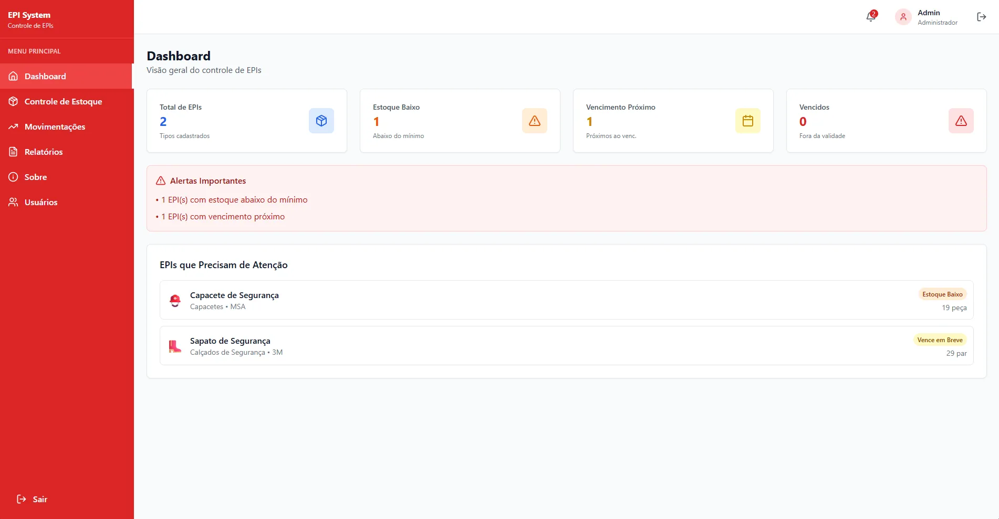
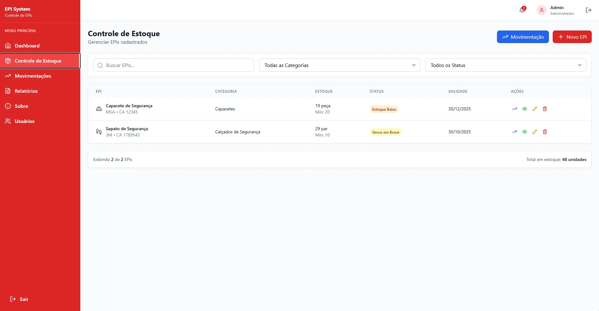
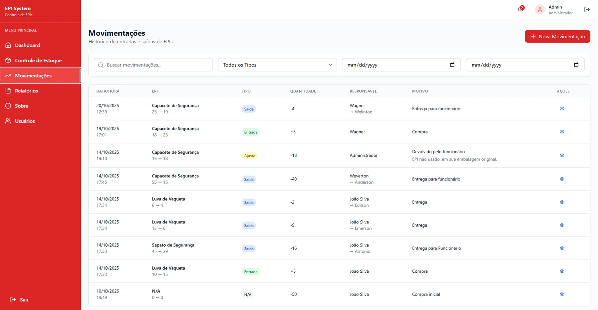
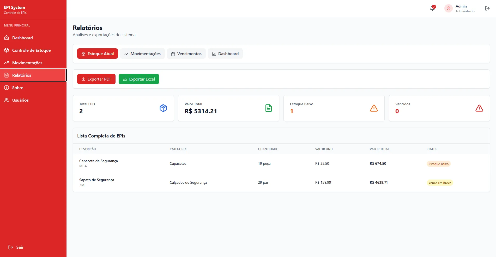
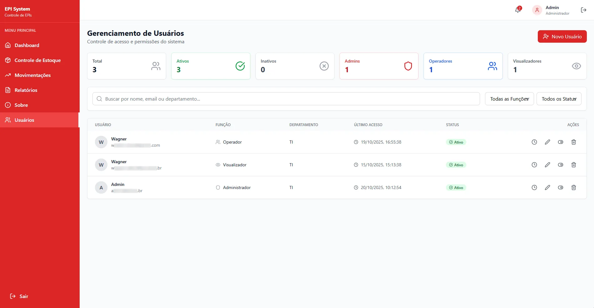
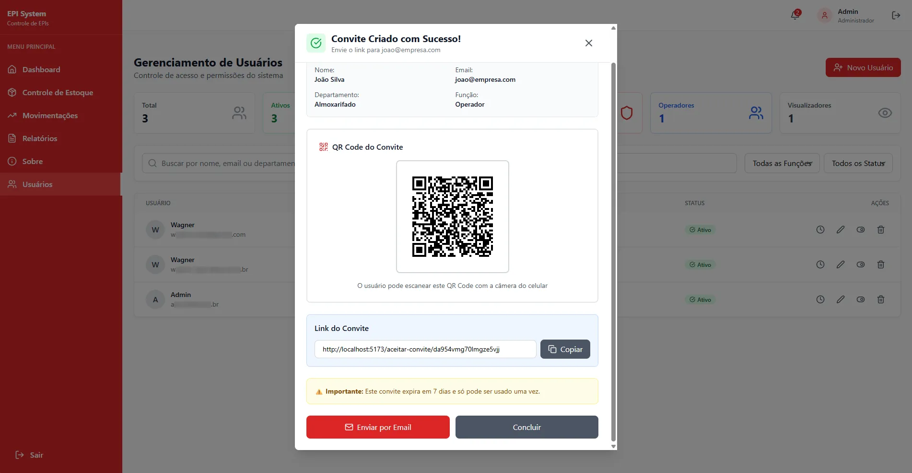

# 🛡️ EPI System - Sistema de Gestão de EPIs

<div align="center">
  <a href="https://github.com/wsabor/epi-system/releases">
  </a>
  
  
  
  
  
</div>

<br>

<div align="center">
  <p><strong>Sistema para gerenciamento de Equipamentos de Proteção Individual</strong></p>
  <p>Controle de estoque, movimentações rastreáveis, relatórios e auditoria — hospedado na sua própria infraestrutura</p>
</div>

---

## 🎯 Sobre o Projeto

O **EPI System** controla o ciclo de vida dos EPIs, da entrada no estoque à entrega ao funcionário, com histórico completo e imutável de cada movimentação.

- ✅ Estoque em tempo real, com alertas de **vencimento** e **estoque mínimo**
- ✅ **Histórico imutável**: toda alteração de estoque é uma movimentação registrada (quem, quando, quanto, por quê, para quem)
- ✅ **Nada com histórico é excluído**: EPIs e usuários são desativados, não apagados
- ✅ **Relatórios** em PDF e Excel
- ✅ **Controle de acesso por função** (administrador, operador, visualizador), aplicado no servidor
- ✅ **Auditoria** de todas as operações, com usuário, data e IP
- ✅ **Acesso somente por convite** (e-mail ou QR Code)
- ✅ **Infraestrutura própria**: PostgreSQL e API em Docker, sem dependência de serviços de nuvem

## ⚡ Funcionalidades

| Área | O que faz |
|---|---|
| 🏠 **Dashboard** | Visão geral do estoque, alertas e gráficos por categoria |
| 📦 **Controle de Estoque** | Cadastro e edição de EPIs (CA, validade, fornecedor, estoque mínimo); desativação e reativação |
| 🔄 **Movimentações** | Entrada, saída (com registro de quem recebeu), ajuste de inventário e perda; o saldo é calculado e validado no servidor |
| 📊 **Relatórios** | Estoque, movimentações por período e vencimentos, com exportação para PDF e Excel |
| 👥 **Usuários** | Convites com validade de 7 dias, edição, desativação e log de auditoria por usuário ou geral |
| 🔐 **Conta** | Login, troca de senha e recuperação de senha por e-mail |

### Permissões

| Ação | Administrador | Operador | Visualizador |
|---|:---:|:---:|:---:|
| Ver dashboard, estoque e movimentações | ✔ | ✔ | ✔ |
| Cadastrar e editar EPIs | ✔ | ✔ | — |
| Registrar movimentações | ✔ | ✔ | — |
| Gerar e exportar relatórios | ✔ | ✔ | — |
| Ativar e desativar EPIs | ✔ | — | — |
| Convidar e gerenciar usuários, ver auditoria | ✔ | — | — |

## 🛠️ Tecnologias

| Camada | Tecnologias |
|---|---|
| Frontend | React 19, Vite, Tailwind CSS 4, React Router, Recharts, jsPDF, SheetJS, Lucide |
| API | Node.js 24, Express 5, Zod, Prisma 7, bcrypt, JWT em cookie `HttpOnly` |
| Banco | PostgreSQL 18 |
| Infraestrutura | Docker Compose, nginx, Caddy (HTTPS) |
| E-mail | EmailJS (chamado pela API) |

### Arquitetura

```
Navegador ──► Caddy (HTTPS, opcional) ──► nginx (frontend + /api) ──► API Node.js ──► PostgreSQL
                                                                           └──► EmailJS
```

Só o nginx (ou o Caddy) fica exposto na rede. A API e o banco ficam na rede interna do Docker.

## 🚀 Rodando em desenvolvimento

Pré-requisitos: **Node.js 24** e **Docker**.

```bash
git clone https://github.com/wsabor/epi-system.git
cd epi-system
cp .env.example .env                                   # ajuste se quiser; os padrões funcionam em dev

docker compose -f docker-compose.dev.yml up -d --wait  # PostgreSQL

cd api
npm install                                            # também gera o Prisma Client
npm run db:migrate                                     # cria as tabelas
npm run db:seed                                        # cria o administrador do .env
npm run dev                                            # API em http://localhost:3000

# em outro terminal, na raiz do projeto
npm install
npm run dev                                            # frontend em http://localhost:5173
```

Entre com `ADMIN_INICIAL_EMAIL` / `ADMIN_INICIAL_SENHA` do `.env`. Sem o EmailJS configurado, os e-mails (convite, redefinição de senha) aparecem no console da API.

### Testes

Com a API e o frontend rodando:

```bash
cd api
npm run test:api   # 52 cenários de ponta a ponta na API (permissões, estoque, concorrência, convites...)
npm run test:ui    # 39 verificações no Chrome instalado na máquina (fluxos completos de cada perfil)
```

Os testes criam dados de exemplo: use só em desenvolvimento.

## 🏭 Produção

Tudo sobe com Docker Compose a partir do mesmo `.env`:

```bash
cp .env.example .env && chmod 600 .env   # preencha com segredos novos
docker compose up -d --build
docker compose exec api ./node_modules/.bin/prisma db seed
```

Passo a passo completo — VM, HTTPS, backups e atualização — em **[docs/DEPLOY.md](docs/DEPLOY.md)**.

## 📁 Estrutura do Projeto

```
epi-system/
├── src/                     # Frontend React
│   ├── components/          # Telas, modais e layout
│   ├── contexts/            # Sessão e permissões do usuário logado
│   ├── hooks/               # Acesso aos dados da API
│   ├── services/api.js      # Cliente HTTP
│   └── utils/
├── api/                     # API Node.js
│   ├── prisma/              # Schema, migrations e seed
│   ├── src/
│   │   ├── routes/          # auth, epis, movimentacoes, usuarios, convites, logs, opcoes
│   │   ├── middlewares/     # autenticação, permissões, erros, limites de tentativas
│   │   ├── services/        # sessão, auditoria, e-mail, formatação
│   │   ├── permissoes.js    # Matriz de permissões (fonte única)
│   │   └── dominio.js       # Categorias, motivos, departamentos (fonte única)
│   ├── scripts/             # Testes de ponta a ponta
│   └── Dockerfile
├── scripts/                 # Backup e restauração do banco
├── docs/                    # ROADMAP e DEPLOY
├── Dockerfile               # Frontend (build + nginx)
├── nginx.conf
├── Caddyfile
├── docker-compose.yml       # Produção
└── docker-compose.dev.yml   # Banco para desenvolvimento
```

## 🔐 Segurança

- Autorização verificada **na API** a cada requisição; o frontend só esconde o que o usuário não pode usar
- Sessão em cookie `HttpOnly` e `SameSite=Strict`; usuário desativado ou com senha trocada perde o acesso na hora
- Senhas com bcrypt; links de convite e de redefinição de senha de uso único, guardados só como hash
- Limite de tentativas de login por IP
- Toda entrada validada no servidor; histórico e auditoria protegidos contra alteração pelo próprio banco
- Cabeçalhos de segurança (CSP, `X-Frame-Options` etc.) no nginx; API e banco fora da rede pública

Encontrou uma falha de segurança? Escreva para o contato abaixo em vez de abrir uma issue pública.

## 📸 Screenshots

### 🏠 Dashboard



### 📦 Controle de Estoque



### 🔄 Movimentações



### 📊 Relatórios



### 👥 Gerenciamento de Usuários



### 📧 Sistema de Convites



## 🗺️ Roadmap

Planejamento, decisões técnicas e próximos passos em **[docs/ROADMAP.md](docs/ROADMAP.md)**.

---

## 📄 Licença

Distribuído sob a licença MIT. Veja `LICENSE` para mais informações.

## 📧 Contato

**Wagner Sabor** - Desenvolvedor Especialista em Next.js e React.js

[](https://github.com/wsabor)
[](https://linkedin.com/in/wagner-sabor)
[](mailto:wsabor.senai@gmail.com)
[](https://wsabor.dev)

**Link do Projeto**: [https://github.com/wsabor/epi-system](https://github.com/wsabor/epi-system)

---

<div align="center">
  <p><strong>Feito com ❤️ e ☕ por Wagner Sabor</strong></p>
  <p>
    <a href="https://github.com/wsabor/epi-system">⭐ Se gostou, deixe uma estrela!</a>
  </p>
</div>
